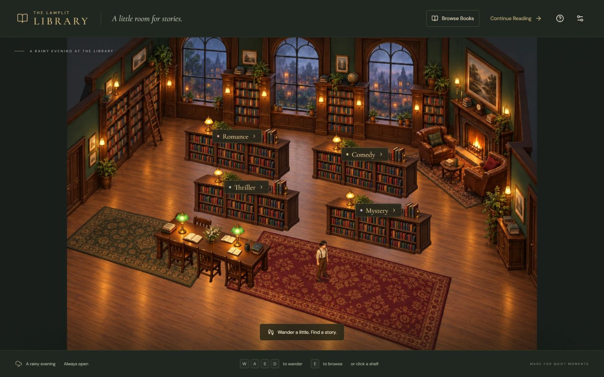

# The Lamplit Library

A cozy, playable browser library. Walk through a rainy evening room, browse four genre shelves, and read eight original short stories in a comfortable book reader.

**[Enter the library](https://KushaCodes1901.github.io/lamplit-library/)**



## Controls

- **Keyboard:** WASD or arrows to walk; E or Enter beside a shelf to browse; Escape returns to the library.
- **Mouse:** click a genre label to walk around furniture to that shelf.
- **Touch:** direction pad and Browse button; bottom genre shortcuts navigate to off-screen shelves.
- **Reading:** previous/next or left/right arrows; chapters, bookmarks, size, three themes, and continuous scrolling.
- **Browse Books** opens the complete searchable catalog without game navigation. **Continue Reading** restores the last book.

Progress, bookmarks, preferences and onboarding are saved only in this browser on this device. Blocked or corrupt storage is handled gracefully; Settings reports when saving is unavailable.

## Local setup

Use Node.js 24 or later.

```sh
npm ci
npm run dev
```

```sh
npm run typecheck
npm run lint
npm test
npm run build
npm run preview
```

React 19, TypeScript, Vite 8 and Phaser 3.90.0. The Phaser renderer is loaded separately from the semantic HTML interface. Essential artwork and Latin fonts are self-hosted. No backend, external content service, runtime AI, keys, or accounts are required.

## Architecture

`src/game/navigation.ts` owns ground coordinates, furniture footprints, collision, and a small A* grid with line-of-sight smoothing. The scene projects those coordinates into the illustrated room, sorts sprites by ground depth, and fades obstructing foreground furniture. React does not rerender every movement frame. Game input is stopped and rendering sleeps while a panel is open; listeners and the engine are cleaned up on unmount.

`src/data/books.ts` contains the eight complete original AI-assisted demo stories, two per genre. `src/reader` measures semantic text at the current page size, splits contiguous word ranges without dropping content, and preserves immutable word anchors through font changes, resizing and rotation. Bookmarks use those same anchors. `src/lib/storage.ts` validates and versions local data.

The source structure supports adding books without changing the scene or reader. PDF/EPUB import would require a separate parser, accessible text extraction, stable content IDs and a rights-aware upload flow; it is outside this demo.

## Deployment and verification

GitHub Actions runs type checking, lint and focused tests, builds with `VITE_BASE_PATH=/<repository-name>/`, and deploys through GitHub Pages. Enable **Settings → Pages → Source: GitHub Actions** for a fork. There is no server-dependent routing.

See [verification results](docs/VERIFICATION.md) and [art/content provenance and generation prompts](docs/ASSETS.md).

## Limits

This is one room with bundled stories and local storage, with no cross-device sync. The character has four facings and a compact two-step walking cycle. Phone cameras follow the visitor, so the bottom genre shortcuts provide access to shelves outside the current view. No ambient audio or swipe gestures are included; reading works with buttons, keys and scrolling. Responsive testing uses browser viewports and simulated pointer events, not physical phones or tablets.
